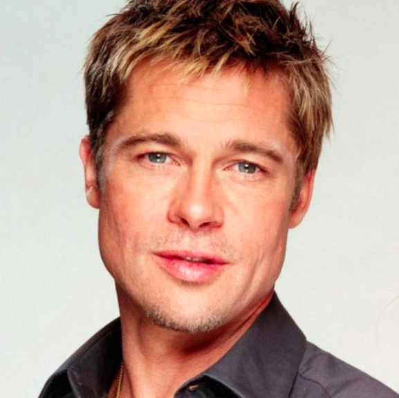
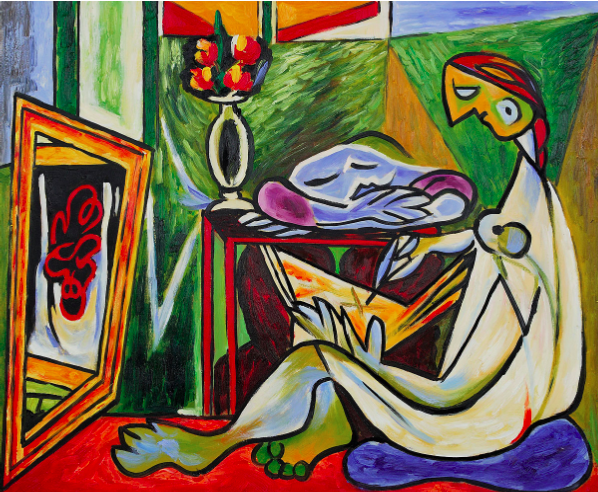
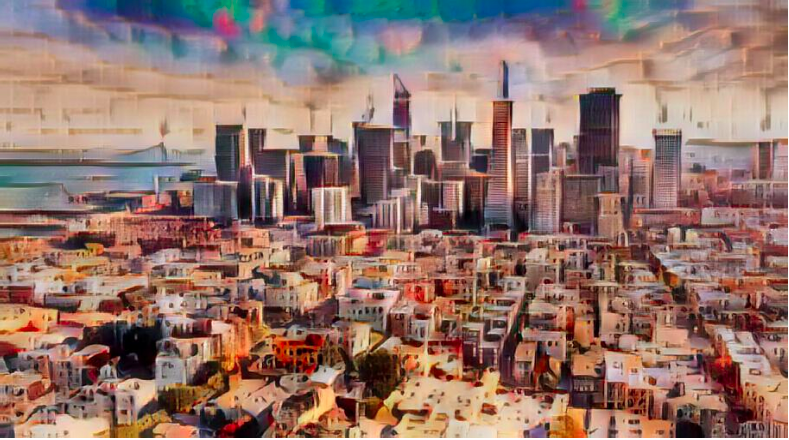

# Neural Style Transfer (assignment_dashtoon)

## Architecture

Gatys et al.'s neural algorithm necessitates a slow, iterative optimization process, limiting its practical application. While fast approximations with feed-forward neural networks have been proposed to accelerate neural style transfer, they often sacrifice adaptability to arbitrary new styles for speed. Here we use a simple yet effective method that enables real-time arbitrary style transfer. At its core is an adaptive instance normalization (AdaIN) layer that aligns the mean and variance of content features with those of style features. This achieves comparable speed to the fastest existing methods, eliminating the need for a pre-defined set of styles. Furthermore, it offers flexible user controls, including content-style trade-off, style interpolation, color, and spatial adjustments—all achievable through a single feed-forward neural network.

[Model Architecture](images/model_architecture.png)


## Library Used

```
matplotlib
numpy
pathlib
PIL
tensorboardX
torch
torchvision
tqdm
```

# Requirements
```
!pip install -r requirements.txt
```

## Code

In the provided notebook, we start by training the VGG model backbone and then train the decoder model using the NST method described earlier. This two-step process ensures a comprehensive training approach for our model.

## Training

For training, we currently use a pretrained VGG encoder. Due to storage and compute limitations, decoder architecture is trained on a small dataset with content and style images. However, there's potential to enhance our network by training on larger datasets, such as using MS-COCO for content and a painting dataset mainly sourced from WikiArt for styles. Each dataset contains around 80,000 training examples. We employ the Adam optimizer with a batch size of 8 content-style image pairs.

During training, we resize both images by setting the smallest dimension to 512 while maintaining the aspect ratio. Subsequently, we randomly crop regions of size 256 × 256. It's worth noting that our fully convolutional network can be applied to images of any size during testing. This approach ensures flexibility and adaptability for different image dimensions.


## Run Test

In the ```nst_train_inference``` section of the notebook, execute all cells except for the ```train``` cell. After completing the ```tests```, you'll receive the respective output for the specified input variables—```content``` and ```style```. Feel free to change input content and style to explore the full potential of our model.

## Download models

Download [decoder.pth](https://drive.google.com/file/d/1bMfhMMwPeXnYSQI6cDWElSZxOxc6aVyr/view?usp=sharing)/[vgg_normalized.pth](https://drive.google.com/file/d/1EpkBA2K2eYILDSyPTt0fztz59UjAIpZU/view?usp=sharing). 

##### Note: In notebook provided, weights get downloaded itself and used for prediction.

## Results

### Example Result 1





### Example Result 2




## Future Work

Future research endeavors aim to explore more advanced network architectures, including residual architecture or structures with additional skip connections from the encoder. We also plan to investigate more intricate training schemes, such as incremental training. Additionally, we envision enhancing the AdaIN layer by considering alternatives like correlation alignment or histogram matching to transfer higher-order statistics. An intriguing avenue of investigation involves applying AdaIN to texture synthesis.

## Reference

[Arbitrary Style Transfer in Real-time with Adaptive Instance Normalization ](https://arxiv.org/abs/1703.06868)
Xun Huang, Serge Belongie  
ICCV 2017 (Oral)
